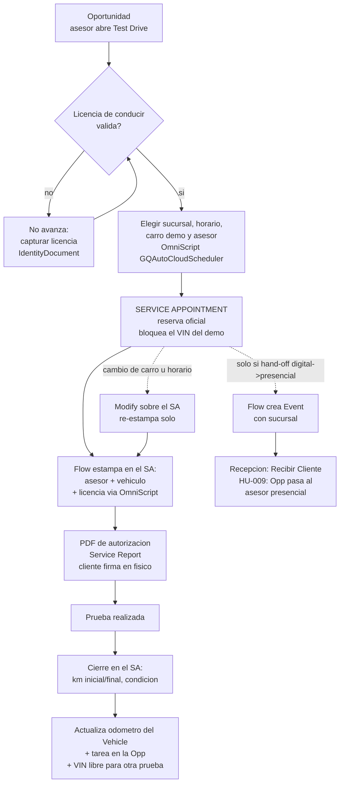

# Test Drive - desenho end to end (papel de pao)

Leyenda rapida:
- El Service Appointment es la fuente de verdad; la Oportunidad sigue siendo la venta.
- Linea punteada = camino opcional (hand-off / reprogramacion).
- El Event solo existe con hand-off; nunca se crea a mano.
