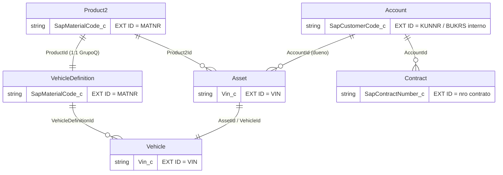

# Arquitectura de carga del inventario de vehiculos SAP -> Salesforce
## Modelo fundamentado en la documentacion oficial (29/07/2026)

Companion del MAPEO-RFC-INVENTARIO-SF.md (veredicto campo a campo). Este doc
fija el MODELO y la MECANICA de carga, con las fuentes oficiales de cada
afirmacion. Regla del proyecto: la doc oficial da el modelo; el describe de
la org (log 29/07) es la verdad vinculante de esta version/licencia.

## 1. El modelo oficial (Automotive Cloud)

Fuentes:
- Data Model Gallery - Automotive Cloud:
  https://developer.salesforce.com/docs/platform/data-models/guide/automotive-cloud.html
- Automotive Cloud Standard Objects (lista completa):
  https://developer.salesforce.com/docs/atlas.en-us.automotive_cloud.meta/automotive_cloud/automotive_objects.htm
- Vehicle (objeto):
  https://developer.salesforce.com/docs/atlas.en-us.automotive_cloud.meta/automotive_cloud/sforce_api_objects_vehicle.htm
- Automotive Cloud Fields on Asset (campo VehicleId en Asset):
  https://developer.salesforce.com/docs/atlas.en-us.automotive_cloud.meta/automotive_cloud/sforce_api_objects_asset.htm
- Automotive Cloud Fields on Standard Objects (Product2 automotive fields):
  https://developer.salesforce.com/docs/atlas.en-us.automotive_cloud.meta/automotive_cloud/platform_objects.htm

Roles de los objetos en el modelo oficial:

| Objeto | Rol oficial | Evidencia en la org (describe 29/07) |
|---|---|---|
| Product2 | Catalogo comercial; en Automotive lleva los campos de modelo (MakeName, ModelName, ModelYear, VehicleTrimLevel, Family) | Confirmado: 53 campos, Family sembrado (Autos/Motos/...) |
| VehicleDefinition | Especificacion tecnica del modelo/version; SIEMPRE apunta a un Product2 | ProductId OBLIGATORIO |
| Asset | La instancia COMERCIAL del bien (posesion: quien es el dueno); el eslabon con Account | Asset.AccountId; doc oficial: Asset tiene campo VehicleId ("represent an asset as a vehicle") |
| Vehicle | La instancia FISICA del vehiculo (VIN, chasis, odometro, ubicacion) | AssetId + VehicleDefinitionId + VehicleIdentificationNumber OBLIGATORIOS |
| Account / Contact | Partes (dueno, cliente, sociedad interna) | CurrentOwnerId -> Account |
| Contract | Acuerdos asociados (garantias/servicios/financiacion segun uso) | requiere AccountId |

Relacion clave del modelo (doble enlace oficial): Vehicle.AssetId apunta al
Asset y Asset.VehicleId apunta al Vehicle. La pareja Asset+Vehicle es UNA
unidad: Asset = dimension comercial (dueno/valor), Vehicle = dimension
fisica (VIN/estado). Por eso el describe muestra AssetId obligatorio en
Vehicle: no existe unidad fisica sin su cara comercial.

Diagrama (cadena de carga con llaves):



## 2. La mecanica oficial de upsert por External ID

Fuentes:
- Upsert Records Using sObject Rows by External ID (PATCH):
  https://developer.salesforce.com/docs/atlas.en-us.api_rest.meta/api_rest/resources_sobject_upsert_patch.htm
- Insert or Update (Upsert) a Record Using an External ID:
  https://developer.salesforce.com/docs/atlas.en-us.api_rest.meta/api_rest/dome_upsert.htm
- Upsert con sObject Collections (hasta 200 registros por request):
  https://developer.salesforce.com/docs/atlas.en-us.api_rest.meta/api_rest/resources_composite_sobjects_collections_upsert.htm
- Relating Records by Using an External ID (referenciar al PADRE por su
  llave externa, sin query de Id):
  https://developer.salesforce.com/docs/atlas.en-us.apexcode.meta/apexcode/langCon_apex_dml_nested_object.htm

Lo que la mecanica garantiza (y por que la adoptamos):
1. IDEMPOTENCIA: la misma carga corrida dos veces no duplica - el registro
   se resuelve por la llave externa (crea si no existe, actualiza si existe).
2. SIN LOOKUPS INTERMEDIOS: el hijo referencia al padre por la llave externa
   del padre (ej. en el upsert de Vehicle: Asset resuelto por Vin__c,
   VehicleDefinition por SapMaterialCode__c). Mule no consulta Ids.
3. LOTE: sObject Collections upserta hasta 200 por request - dimensiona el
   batching de MuleSoft.

Requisito de plataforma: la llave debe ser un campo marcado External ID.
El describe (29/07) probo que NINGUN campo standard de los 3 objetos tiene
ese flag (el Product2.ExternalId standard existe pero no es llave de
upsert). Por eso los UNICOS campos custom de la carga son las llaves:

| Objeto | Campo llave (custom, Unique + External ID) | Valor |
|---|---|---|
| Account | SapCustomerCode__c (o el campo "Codigo Cliente" existente, si ya es unique+extid - VERIFICAR antes de crear) | KUNNR; cuentas internas de sociedad = BUKRS |
| Product2 | SapMaterialCode__c | MATNR (ProductCode sigue = MATNR para exhibicion) |
| VehicleDefinition | SapMaterialCode__c | MATNR (1:1 con Product2) |
| Asset | Vin__c | VIN/chasis |
| Vehicle | Vin__c | VIN/chasis (ademas llenar el nativo VehicleIdentificationNumber, obligatorio) |
| Contract | SapContractNumber__c | numero de contrato SAP |
| User | FederationIdentifier (NATIVO - sin custom) | identidad corporativa del vendedor |

## 3. Orden de carga (grafo de dependencias)

El orden pedido por el negocio es correcto contra el grafo oficial:

```
1. Account      (sin dependencias; incluye las cuentas internas por BUKRS)
2. User         (sin dependencias; duenos/vendedores referenciados despues)
3. Product2     (sin dependencias)
4. VehicleDefinition  <- Product2 (ProductId obligatorio)
5. Asset        <- Account (dueno) + Product2
6. Vehicle      <- Asset + VehicleDefinition (ambos obligatorios) 
7. Contract     <- Account (+ Asset si el contrato referencia la unidad)
```

Reglas operativas de la carga:
- Cada paso solo referencia llaves de pasos ANTERIORES - una corrida parcial
  nunca deja hijos huerfanos.
- Re-ejecutar cualquier paso es seguro (idempotencia por llave).
- PRERREQUISITO del paso 5: cuentas internas por sociedad (BUKRS) creadas en
  el paso 1 CON la llave poblada - el Asset de stock las referencia.
- El paso 6 completa la pareja: tras el upsert de Vehicle, poblar
  Asset.VehicleId (doble enlace oficial) - lo hace el mismo flujo Mule
  (segunda pasada) o un Flow after-save en Vehicle; decidir en el diseno
  tecnico del contrato.
- Volumetria: lotes de 200 (limite oficial de sObject Collections).

## 4. Limites y decisiones que este modelo respeta

- SAP fuente de la verdad del inventario; SF exhibe (guard de arquitectura).
- Cero objetos custom; custom SOLO las llaves tecnicas de upsert (decision
  Diego 29/07 tras revision zero-custom: BUKRS via posesion/cuenta interna,
  F_INGRESO via Asset.PurchaseDate, flags via matriz de Status, Centro/
  Deposito via StockCode - ver MAPEO seccion RESULTADO DEL DESCRIBE).
- La asetizacion de la VENTA no crea el Asset: lo TRANSFIERE (el sync ya lo
  creo con la unidad); consistente con el ciclo Borrador -> Facturado.
- Naming GRPQM: API ingles PascalCase, labels espanol, Description con
  paises y proposito en cada campo llave.

## 5. Verificaciones pendientes antes del build

1. Account "Codigo Cliente": API name real y flags (unique/external id) -
   reusar o crear SapCustomerCode__c.
2. Validation rules de los 7 objetos de la cadena (query Tooling del
   DESCRIBE-INVENTARIO.apex ampliada a Account/Asset/Contract).
3. Confirmar con SAP: SERIE (VIN vs chasis vs serie comercial) - define el
   valor exacto de la llave Vin__c.
4. Nota de acceso: las URLs oficiales de este doc no son alcanzables desde
   el entorno de la sesion (403 de egress) - fueron citadas para
   verificacion en el navegador del equipo; el describe de la org es la
   evidencia vinculante usada en las decisiones.
